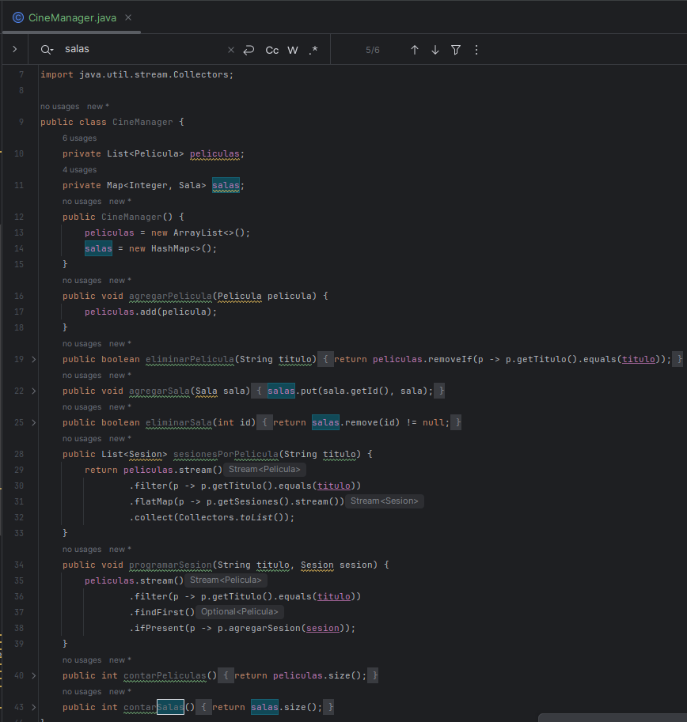
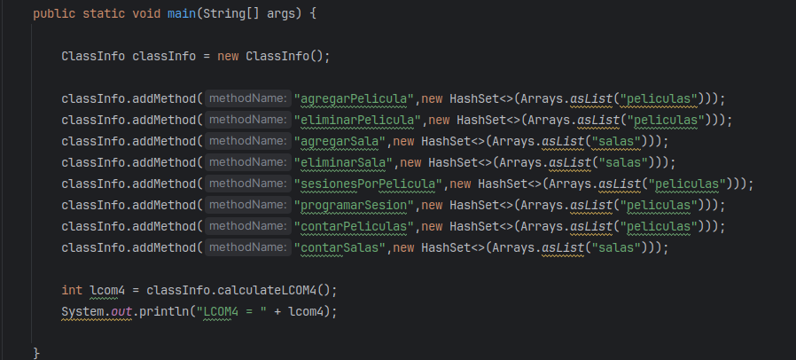
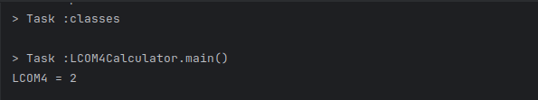
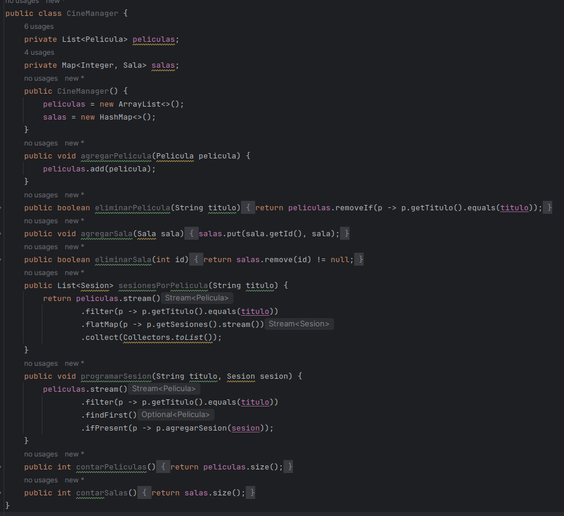
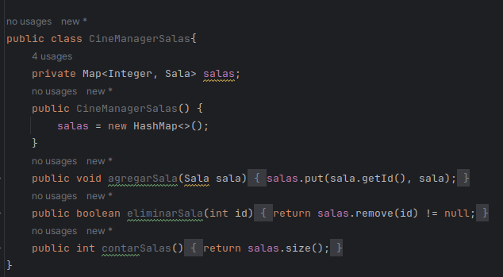
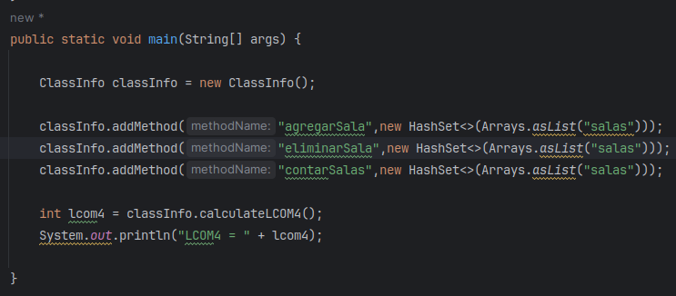
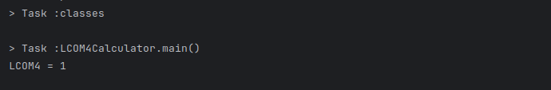
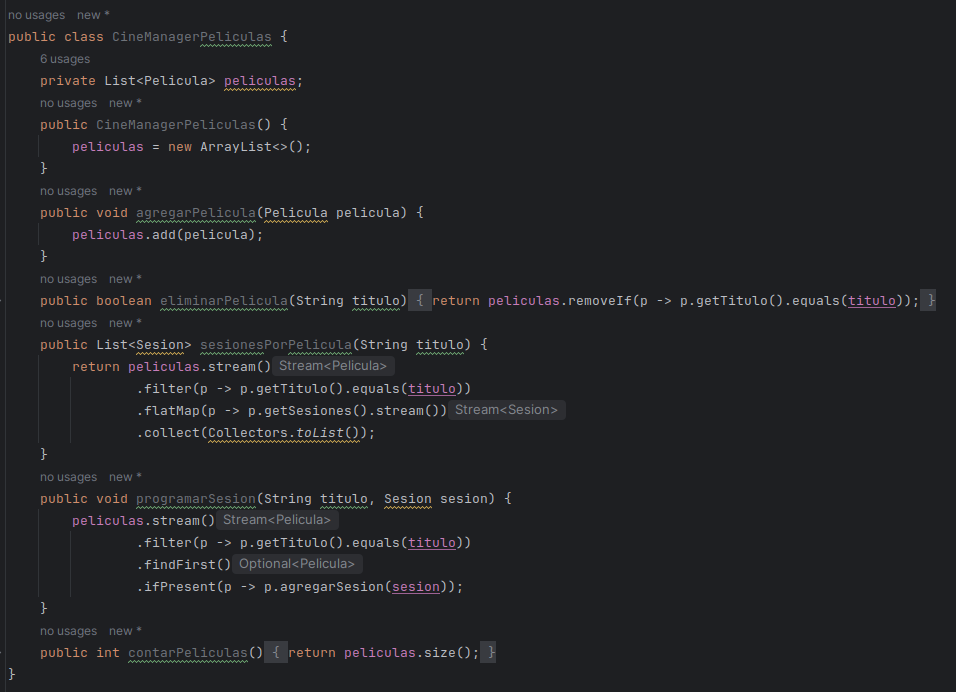
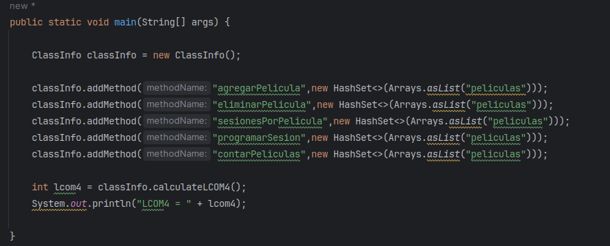

# Actividad Metricas de calidad I

Podemos notar que existen 2 atributos, ademas podemos apreciar que cada metodo de esta clase solo usa un atributo de la misma, por lo que considerando eso, deberia existir un LCOM4 = 2, (numero de componentes conectadas)

Comprobemos esto mediante la clase que hemos implementado

Como el **LCOM4 = 2**, podemos separar esta clase en 2 clases de tal forma aumentamos la cohesion en nuestro codigo.

#### Podemos notar que hay dos grupo de metodos:

1. Existe un grupo de metodos que se encargan de **manejar las salas** (que usan a su vez el atributo salas), es decir, son componentes mutuamente accesibles
2. Existen otros grupos de metodos que se encargan de manejar las peliculas (que usan a su vez el atributo peliculas), es decir estas otras componentes son mutuamente accesibles.

#### Ahora podemos descomponer esta clase en otras 2:

1. **Una que se encargue del manejo de salas**

Veamos ahora su LCOM4 

2. **Una que se encargue del manejo de peliculas**

Veamos ahora su LCOM4 

# Actividad Metricas de calidad II

- UsuarioModulo
- GrupoContactoModulo
- ContactoOperacionesModulo
- Usuario
- SistemaContactos

