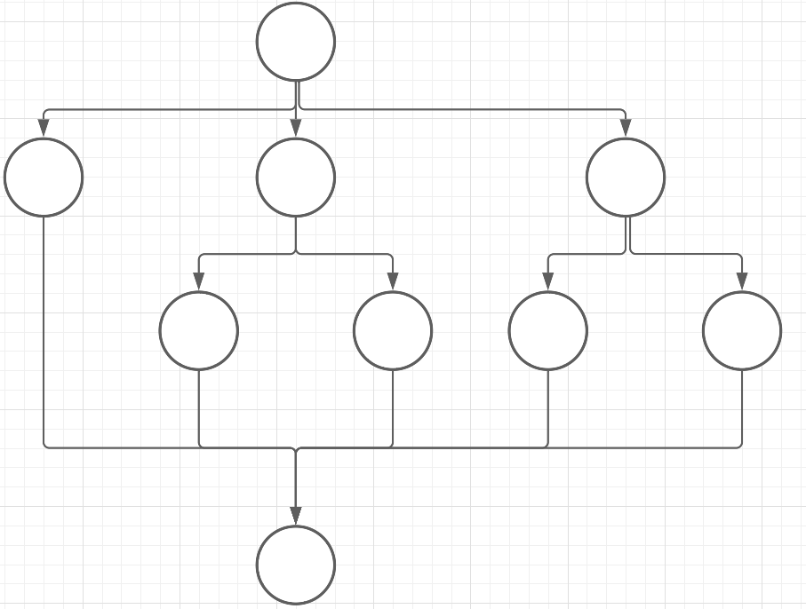

## Ejercicios de complejidad Ciclomatica

#### ejercicio1

- V = 9
- A = 12
- P = 1

**Complejidad Ciclomatica = E-N+2P = 12-9+2 = 5**

El codigo se encarga de imprimir distintos mensajes, lo que abarca lo que representa los caminos independientes que este tiene.

- Positive even number
- Positive odd number
- Negative even number
- Negative odd number
- Number is zero

#### ejercicio2

