## Actividad Pruebas Estructurales

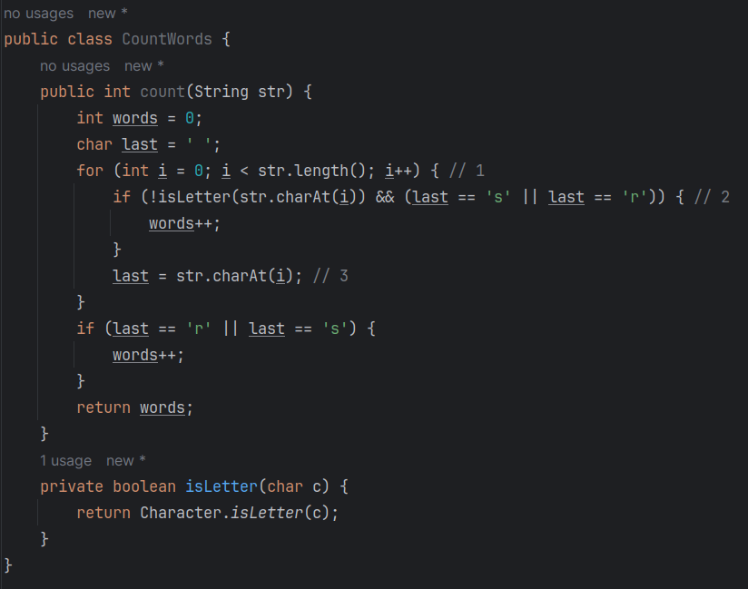

## Ejercicio 1:
Explica qué hacen las líneas 1, 2 y 3 en el código.

    Recorre todo el texto, almacenando siempre el 
    caracter anterior al caracter en la posicion actual, 
    en caso el caracter actual no sea una letra (lo que 
    indica el fin de una palabra) y la ultima letra
    (ultima letra de la palabra) sea 's' o 't' entonces 
    words incrementa en uno.

## Ejercicio 2:

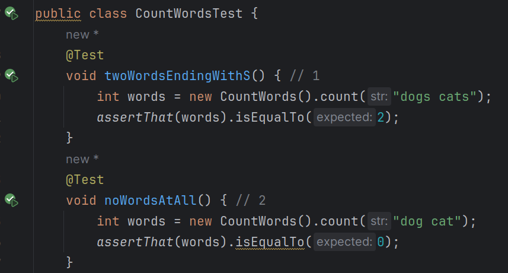

Explica qué hacen las líneas 1 y 2 del código. Presenta un informe generado por JaCoCo (www.jacoco.org/jacoco) u otra herramienta de cobertura de código de tu preferencia en el IDE del curso.

    La primera prueba evalua una cadena de texto con 
    2 palabras (dogs y cats) y se espera que la cantidad
    de palabras que terminen en 's' o 'r' sean 2.

    La segunda prueba evalua una cadena de texto con
    las palabras dog y cat y se espera que la cantidad
    de palabras que terminen en 's' o 'r' sea 0.

**Analisis de cobertura**

Gracias a las pruebas estructurales, los testers pueden descubrir por qué este caso de prueba no surgió antes.

**Con sonarqueb**

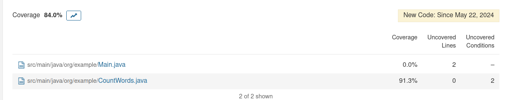
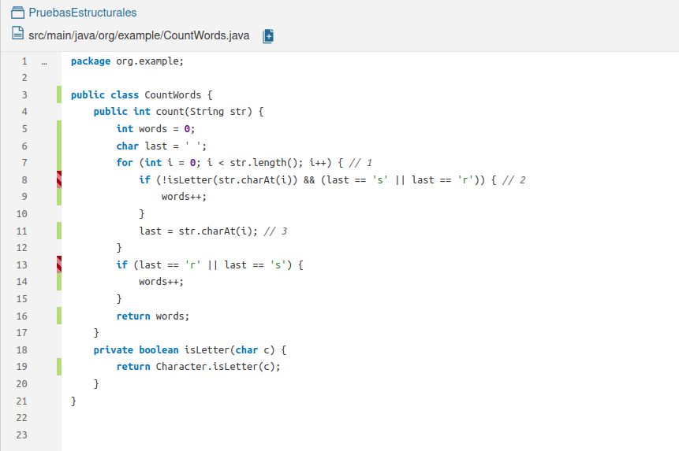

**Con jacoco**

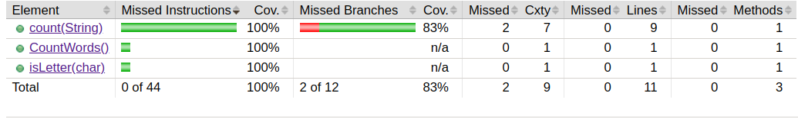
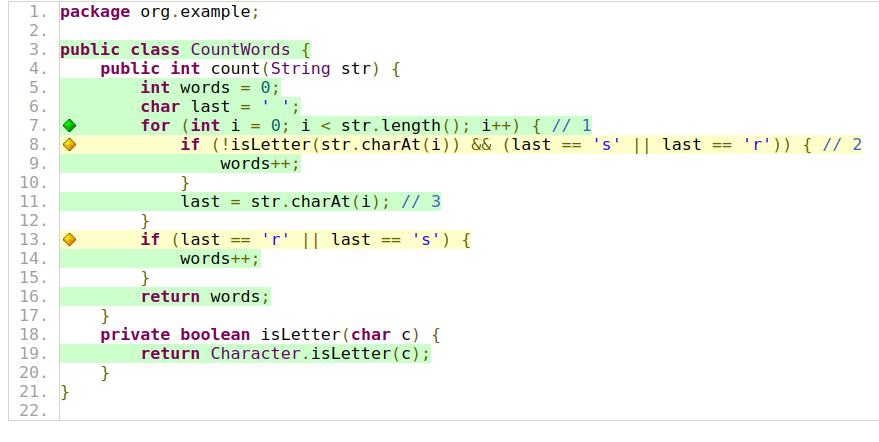

**Verde:** Se ejecutó al menos una vez durante la ejecución de las pruebas.
**Amarillo:** Se ejecuto parcialmente.
**Rojo:** No se ejecuto ni una vez en las pruebas.

Explicacion:

    En este caso podemos tener en cuenta que las pruebas
    solo abarcan los casoss para cuando la letra termina
    en 's' pero no para 'r', por lo que la proposicion 
    last=='r' siempre es false y no es probada. 

## Ejercicio 3:
Explica la línea 1 y con el caso de prueba recién agregado en el conjunto de pruebas, vuelve a ejecutar la herramienta de cobertura. Explica los cambios obtenidos.

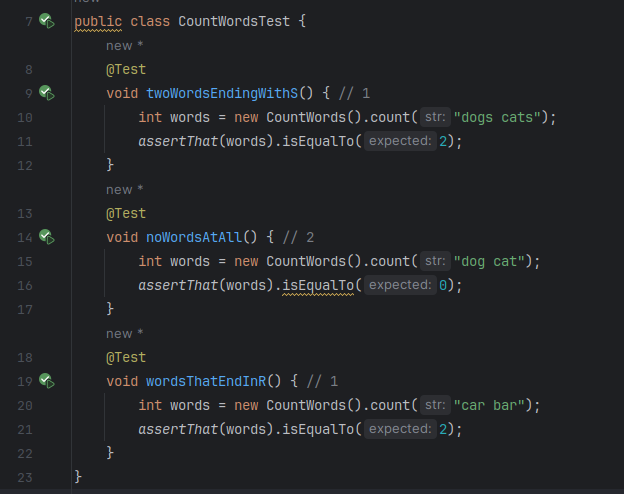

**Con sonarqueb**

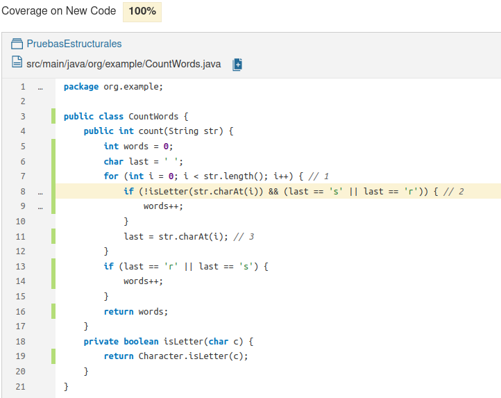

**Con jacoco**

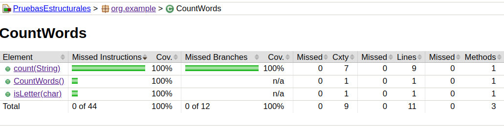
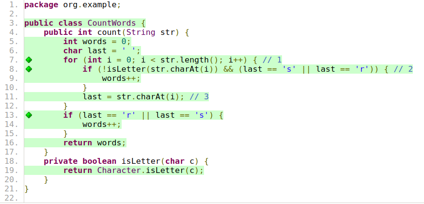

Explicacion:

    Habiendo agregado una nueva prueba que toma en cuenta
    las palabras que terminan en 'r', ahora estamos
    abarcando la proposicion last=='r'.

    Lo mas importante es que hemos tenido un coverage del
    100% lo que quiere decir que todo nuestro codigo 
    esta probado.

## Ejercicio 4:

### parte A

Análisis del código y cobertura

Preguntas:
1. Explica qué hacen las líneas 1, 2 y 3 en el código.
2. ¿Qué sucedería si se eliminara la línea 3 del código?
3. Escribe una descripción de alto nivel de lo que hace este método count.

#### 1. 

    Recorre todo el texto, almacenando siempre el 
    caracter anterior al caracter en la posicion actual, 
    en caso el caracter actual no sea una letra (lo que 
    indica el fin de una palabra) y la ultima letra
    (ultima letra de la palabra) sea 's' o 't' entonces 
    words incrementa en uno.

#### 2.

    Si eliminamos la linea 3 del codigo, la ultima letra
    de cada palabra siempre seria un caracter ' ', por lo
    que nunca entraria a ninguna condicional y el metodo
    count retornaria 0.

#### 3.

    El metodo count, cuenta todas las palabras de un
    texto que terminen en 's' o en 'r', toma como entrada
    el texto y devuelve el numero de palabras que cumplen
    con la condicion anterior.

### parte B

Preguntas:

  4. Explica qué hacen las líneas 1 y 2 del código de prueba.

  5. ¿Qué tipos de casos de prueba adicionales se deberían agregar para mejorar la cobertura?

#### 4.

    La primera prueba evalua una cadena de texto con 
    2 palabras (dogs y cats) y se espera que la cantidad
    de palabras que terminen en 's' o 'r' sean 2, ya que
    ambas palabras terminan en 's'.

    La segunda prueba evalua una cadena de texto con
    las palabras dog y cat y se espera que la cantidad
    de palabras que terminen en 's' o 'r' sea 0, ya que
    ninguna palabra termina en 's' o 'r'.

#### 5. 
    
    Se deberia agregar una prueba que evalue los casos
    en los que existen palabras que terminan en 'r'.

### parte C

 6. Ejecuta las pruebas unitarias usando JaCoCo o una herramienta de cobertura de código de tu elección.

 7. Genera y presenta el informe de cobertura.

 8. Identifica las partes del código que no están cubiertas por las pruebas.

#### 6. , 7.

**Con jacoco**

    Jacoco nos da un informe de cobertura, para ver 
    cuales son las partes del codigo que estan siendo
    probadas, completamente(verde) o parcialmente
    (amarillo) o si de plano no existe prueba que cubra
    cierta parte del codigo(rojo)
#### 8.
    La linea 8 y la linea 13, estan siendo parcialmente
    probadas por las pruebas ya que, al no existir 
    ninguna prueba que verifique para una palabra 
    que termina en 'r' entonces esta proposicion 
    nunca llega a ser verdadera, lo que implica que
    no estamos probando ese escenario.

## Ejercicio 5:

### parte A: Nuevas pruebas

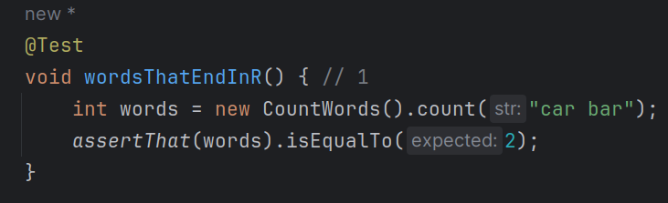

### parte B:

1. Agrega las nuevas pruebas al conjunto de pruebas.
2. Vuelve a ejecutar la herramienta de cobertura.
3. Explica los cambios obtenidos en el informe de cobertura.
4. Si todavía hay partes del código no cubiertas, repite el proceso: identifica las partes no
cubiertas, comprende por qué no están cubiertas y escribe una prueba que ejerza esa parte
del código

#### 1. 

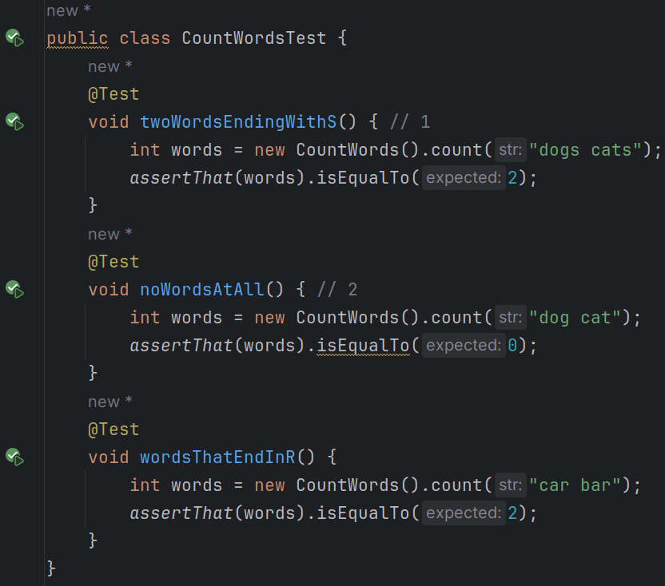

#### 2. , 3.

    Habiendo agregado una nueva prueba que toma en cuenta
    las palabras que terminan en 'r', ahora estamos
    abarcando la proposicion last=='r'.

    Por lo que podemos concluir que el codigo funciona
    como se esperaba ya no solo con palabras que terminen
    en 's' o no, sino que ahora tambien para palabras que
    terminen en 'r'.

#### 4. 

    Como podemos ver en el reporte anterior, se alcanzo
    un coverage del 100% lo que indica que todo nuestro
    codigo esta bajo prueba.

## Ejercicio 6:

### Parte A: Exploración

1. Modifica el método count para mejorar su claridad o eficiencia.
2. Escribe pruebas unitarias adicionales para asegurar que las modificaciones no rompan la funcionalidad existente.

#### 1. 

Hemos realizado los siguientes cambios:

- Hemos agregado un constructor CountWords que verifique que el texto siga un cierto formato (terminar en una letra y no estar vacio).

- En el metodo CountWords hemos agregado un caracter en blanco al final de la cadena para que no sea necesario validar de nuevo para la ultima palabra de la cadena.

- En el metodo CountWords hemos encapsulado la condicional que verifica si la ultima palabra termina o no en r o s en el metodo lastWordEndsInRorS. 

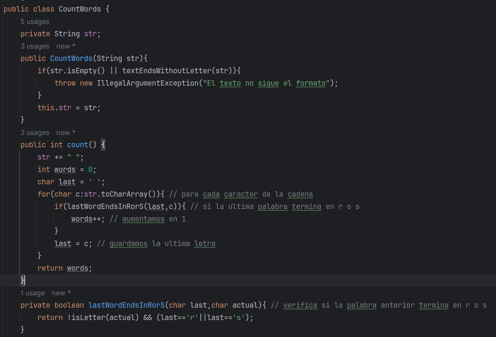

#### 2.

Ahora hemos agregado la siguiente prueba parametrizada para verficar que el texto tenga cierto formato adecuado para que pueda usarse en el metodo count():

Ademas hemos seguido el patron AAA en las pruebas anteriores.

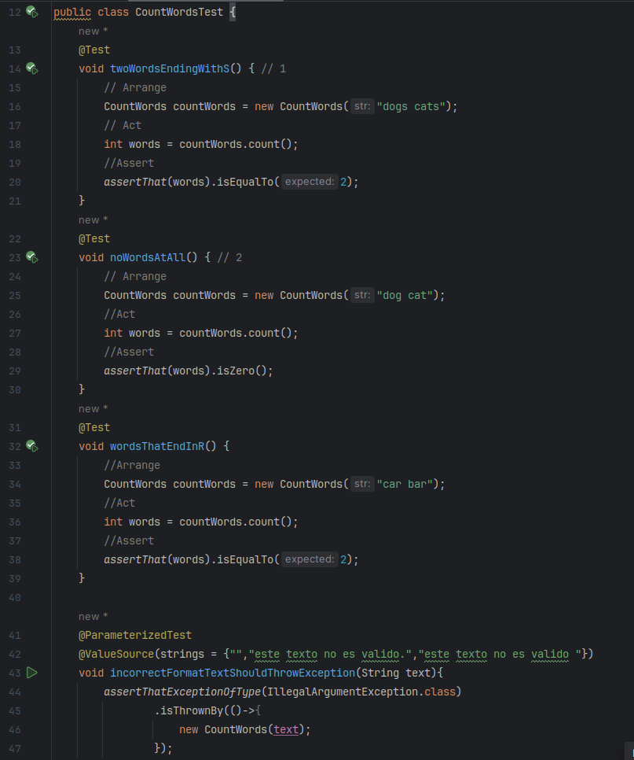

### Parte B: Exploración

3. Genera un informe final de cobertura después de todas las modificaciones y nuevas pruebas.
4. Compara el informe final con el informe inicial y discute los cambios y mejoras en la cobertura de código.

### 3.

Ahora generamos el reporte de covertura, en donde vemos que es del 100%.

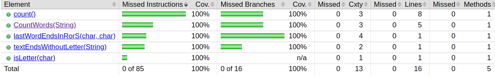

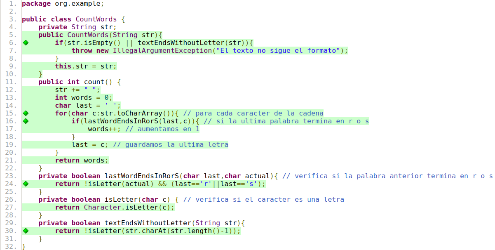

### 4. 

En el informe final hemos mejorado ciertos puntos, entre estos se encuentran:

- Hemos reducido la complejidad del metodo count haciendolo mas facil de leer.
- Hemos agregado un constructor que verifica el formato del texto, con su respectiva prueba que espera un excepcion en caso el texto no tenga el formato adecuado.
- Ambos informes tiene una covertura del 100%, por lo que los cambios agregados tambien se estan probando adecuadamente.

### Ejercicio 12

Explica los comentarios 1, 2, 3, 4 y 5 del código anterior.

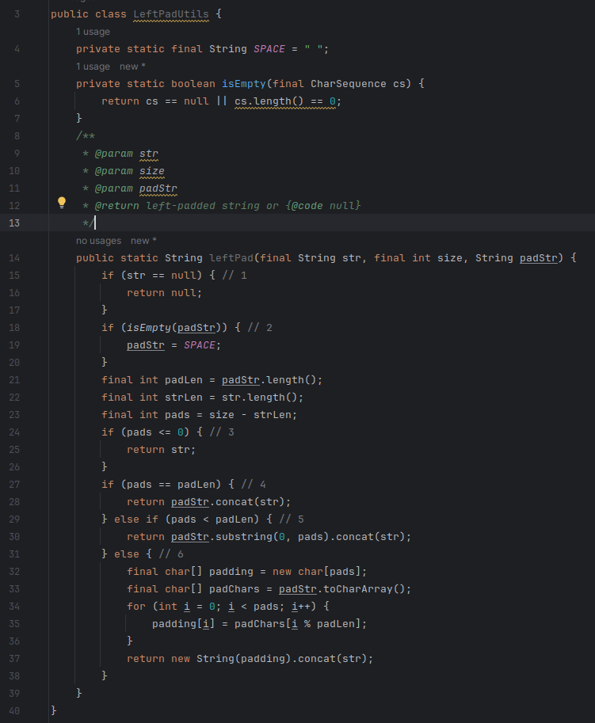

El metodo recive como parametros:

- str : Cadena inicial (base).
- size : Tamaño de la cadena devuelta.
- padStr : Es la cadena que se va a insertar al inicio (por la derecha) a la cadena inicial.

1. Vefica si la cadena inicial es nula, si es asi, retorna una cadena nula.
2. Si la cadena a insertar esta vacia, entonces solo insertamos un espacio.
3. Si pads < 0, lo que indica que que el tamanio de la cadena devuelta es menor que la cadena incial, entonces retornar una subcadena de la cadena inicial.
4. Si pads = padLen, indica que el tamanio de la cadena devuelta calza perfectamente con el tamanio de la cadena incial y el padStr que se concatena al inicio.
5. Si pads < padLen, indica que el tamanio de la cadena devuelta sobrepasa lo que tiene permitido, por lo que solo se toma una subcadena de esta.
6. Si pads > padLen, indica que el tamanio de la cadena devuelta sobra por lo que ahora se repetiran un numero definido de veces hasta que se complete.

Podemos idear pruebas individuales para casos excepcionales:

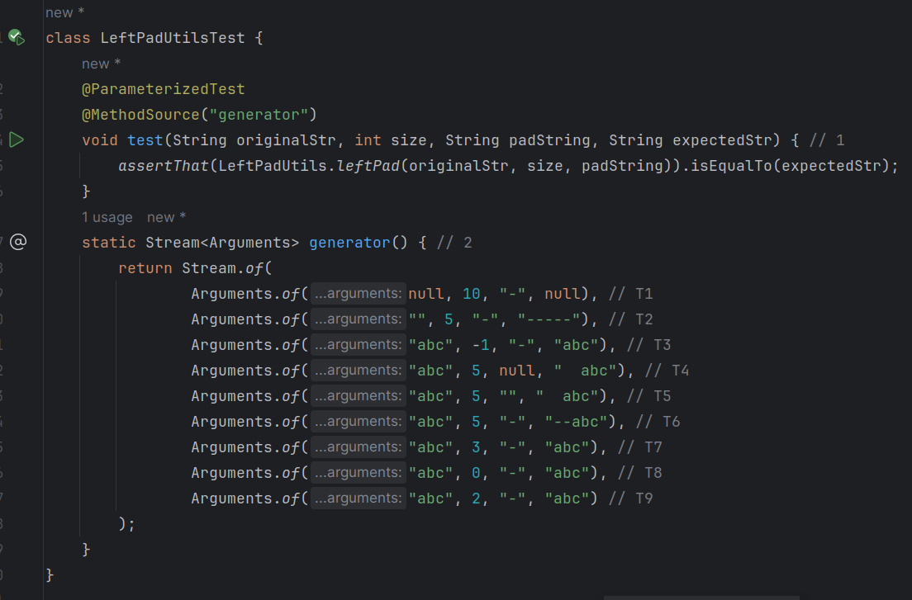

En las lineas 1, 2 y 3 o en general, lo que estamos haciendo es pasar parametros mediante la funcion generator al metodo test "test", podemos ver que se estan recibiendo como parametros los valores puestos en Arguments.of().

Es hora de aumentar el conjunto de pruebas a través de pruebas estructurales. Para eso utilizaremos una herramienta de cobertura de codigo.

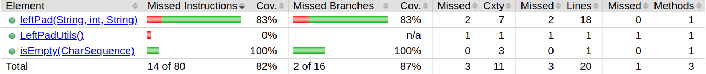

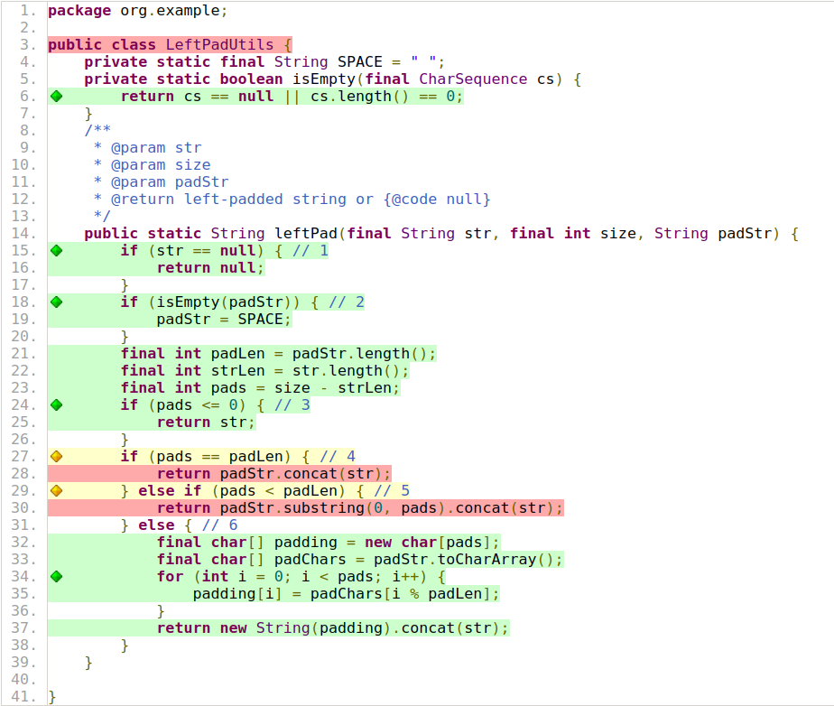

Podemos ver que entre todas las pruebas no entra ni una sola vez al condicional 4 y 5, es decir, si bien es cierto el condicional se ejecuta, nunca es verdadero.

Por lo que podemos agregar ciertos tests para que se puedan abarcar estas lineas de codigo.

Agregamos **T10, T11 y T12**.
Un test evalua que la cadena de salida --abc tenga justamente 5 caracteres, lo cual encaja perfectamente.
Los otros dos verfican, las otras 2 condiciones, cuando se sobrepasa y cuando sobra.

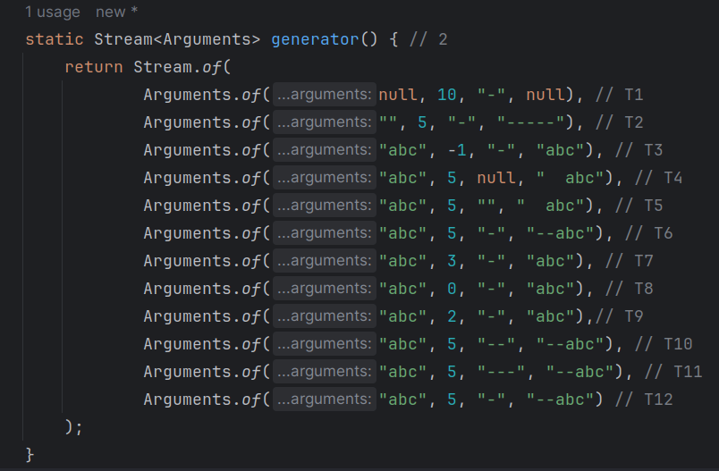

Ejecutamos de nuevo la herramienta de cobertura de codigo.

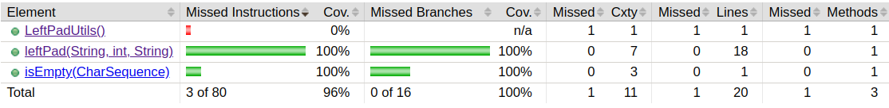

Y podemos ver que la cobertura del codigo es del 100% para el metodo leftPad.

Todas las rutas posibles son cubiertas en su totalidad.

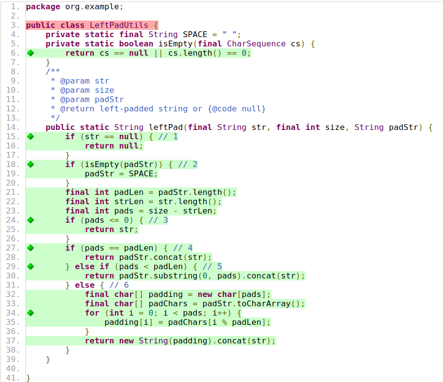

### Clumps

Pregunta 16 : explica las líneas 1, 2 y 3 del código anterior. 

- En la linea 1 se verifica si el arreglo es nulo o esta vacio en ese caso retorna 0.

- En la linea 2, verifica si el numero anterior y el numero actual en el arreglo son iguales y aun no estamos en un clump, en ese caso 
inclump = true (indicamos que estamos dentro de un clump) y aumentamos la cantidad de grupos en 1.

- En la linea 3 verificamos si el numero anterior es diferente del actual, en ese caso se termina el clump, es decir, inClump=false.

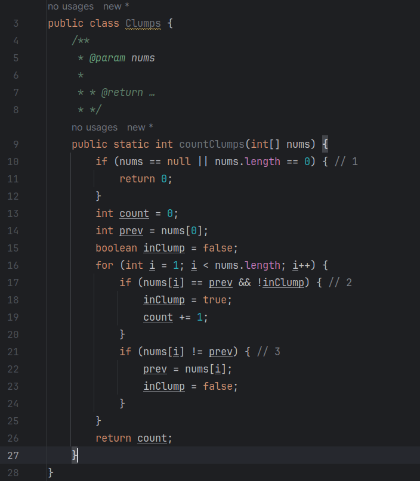

Las pruebas son las siguientes y abarcan los 4 puntos:

• T1: una matriz vacía.
• T2: una matriz nula.
• T3: una matriz con un solo grupo de tres elementos en el medio (por ejemplo, [1,2,2,2,1]).
• T4: una matriz con un solo elemento.

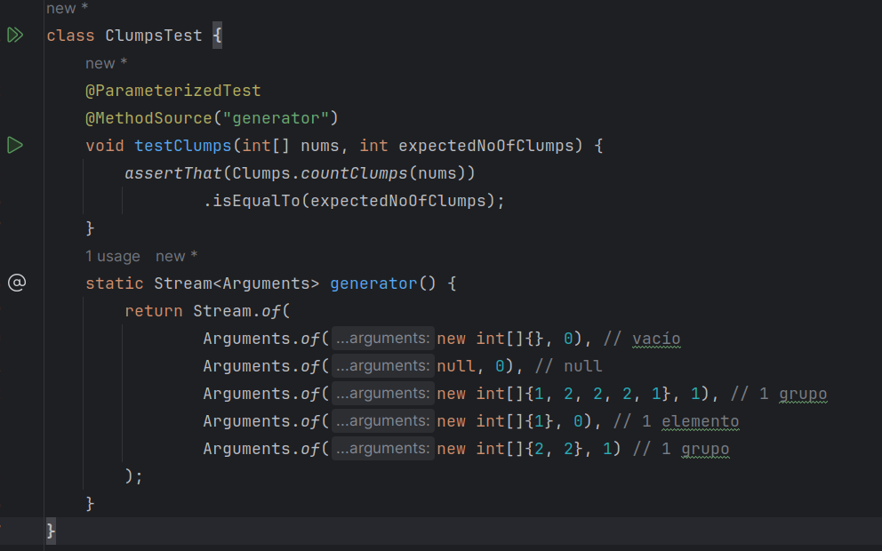

Vemos que se logra una captura del 100% lo que indica que todo nuestro codigo esta siendo probado.

Las expresiones if(num==prevs) y else if(nums!=prev) indican si el numero previo es igual o no al numero actual, en este caso podemos ver que estas lineas estan cubiertas completamente por las pruebas.

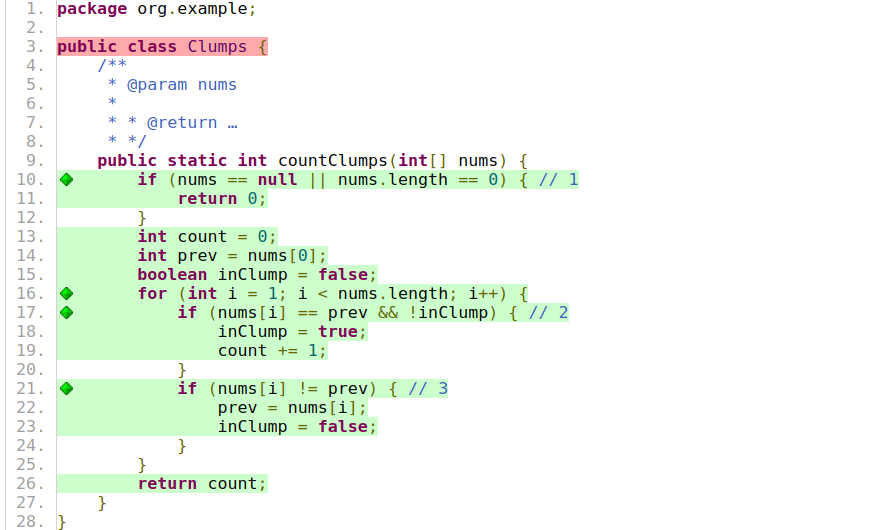

Agregamos 3 pruebas mas T10, T11 y T12 

• T10: la longitud de padStr es igual a los espacios restantes en str.
• T11: la longitud de padStr es mayor que los espacios restantes en str.
• T12: la longitud de padStr es más pequeña que los espacios restantes en str (esta prueba puede ser similar a T6).

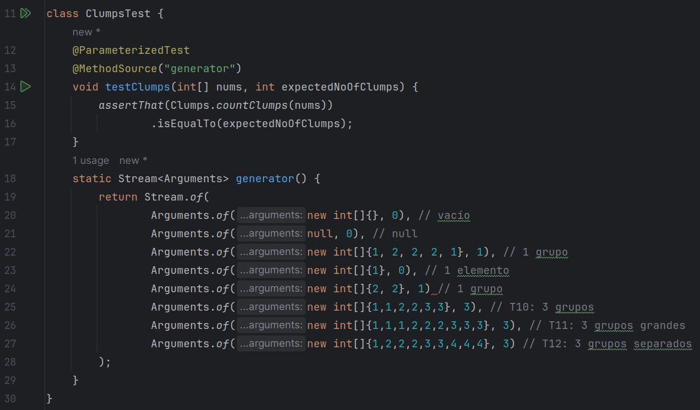

Podemos ver que el informe es el mismo, se siguen abarcando el 100% de cobertura de codigo.

Esto se debe a que ya con las primeras pruebas estabamos abarcando mas de un grupo, lo que hacia que se ejecutaran ambas condicionales y en general, todo el codigo, al agregar los ultimos 3 en donde se obtienen mas de 1 grupo abarcamos los casos ya abarcados en el primer conjunto de pruebas (los caso grupos>1). Es por esto que la cobertura del codigo antes era del 100% al igual que ahora.

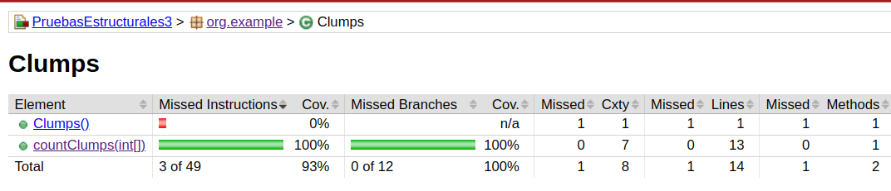
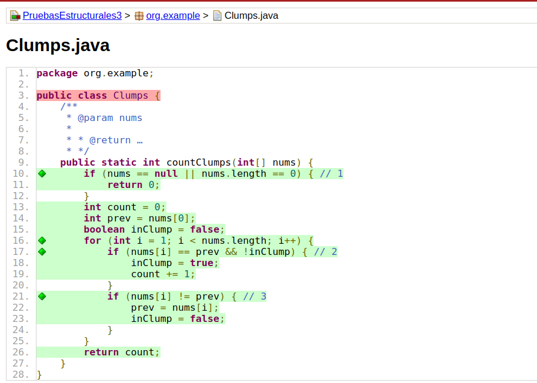

