# Actividad Refactorizacion

**Ejercicio 1:** Refactorización para mejorar la cohesión y reducir el acoplamiento. Sea la siguiente aplicación Java con clases excesivamente acopladas y con baja cohesión. Debes identificar problemas específicos de cohesión y acoplamiento y refactorizar el código para mejorar estas métricas. Deberán proporcionar un breve informe explicando qué cambios se realizaron y por qué.

**EmployeManager**

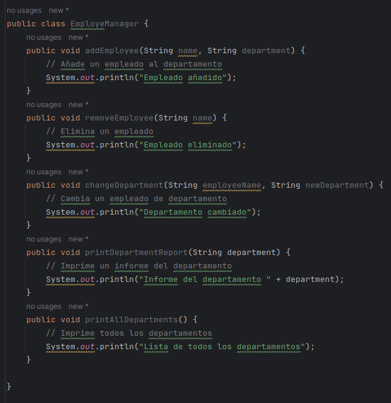

**Completando el codigo**

**EmployeManager**
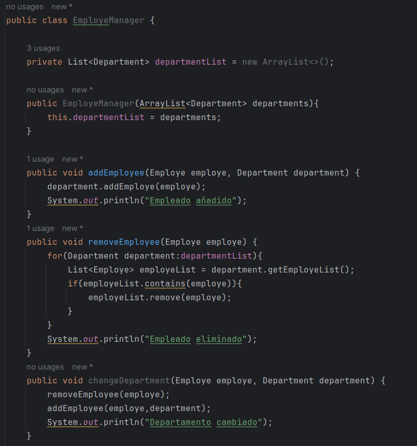
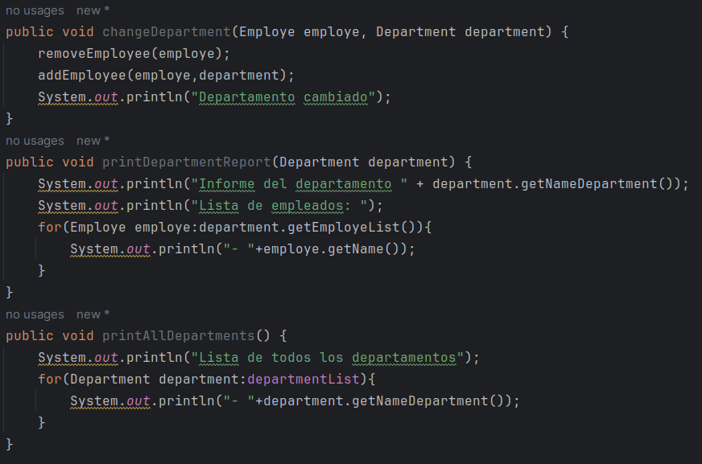

**Employe**
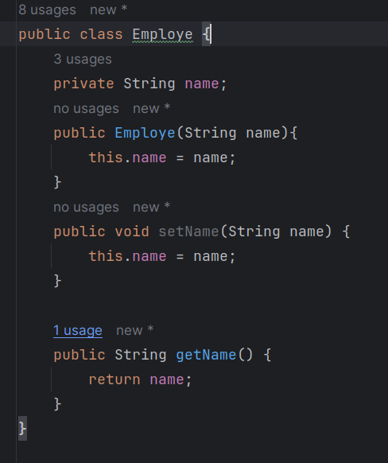

**Department**
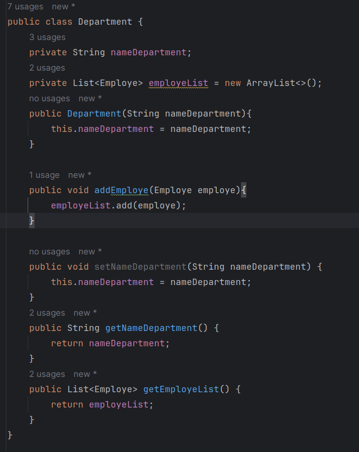

**Problemas**

- La clase realiza 2 tareas a la vez, la de gestionar al empleado con su departamento y la de imprimir los deparamentos, hacer reportes. Esto no es correcto porque reduce la cohesion de una clase, ya que los metodos de esta clase realizan 2 tareas a la vez.

- En cuanto a la acoplacion de clases, podemos ver que no existe una dependencia innecesaria entre las clases ademas el acoplamiento entre estas es pequeño, ya que:

    1. La clase Employe no depende de ninguna clase
    2. La clase Department solo depende de la clase Employe (Cada departamento tiene la tarea de conecer a sus empleados).
    3. La clase EmployeManager depende de las clases Employe y Department, las cuales son necesarias para su correcta implementacion y funcionamiento.

**Soluciones**

1. Separar la clase imprimir reportes de la de gestion del empleado y su departamento.

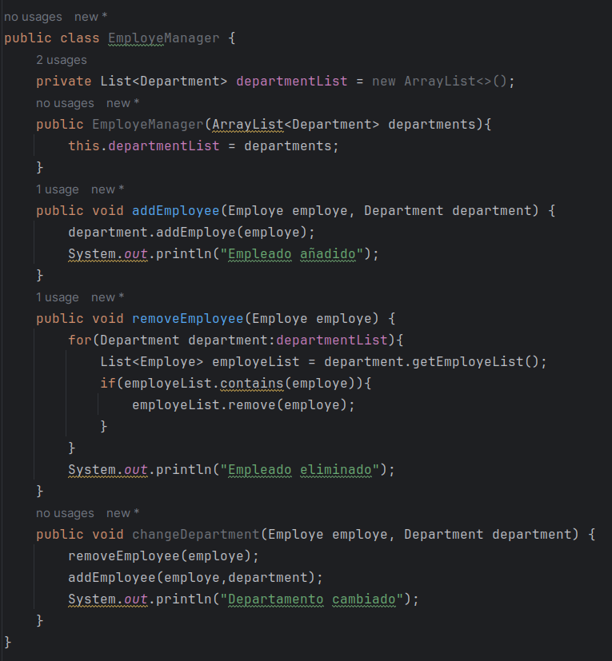

2. Podemos ver que podemos refactorizar un poco este codigo, ya que consideramos que el departamento al conocer los empleados, debe ser este el que verifique si un empleado se encuentra o no y en caso se encuentre eliminarlo de la lista en el metodo removeEmploye()

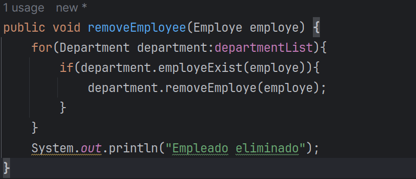

Aqui podemos ver la clase Department

**Ejercicio3:** Imaginemos que tenemos una clase en un sistema de gestión de contenido que maneja tanto la lógica de usuario como la lógica de la base de datos para artículos de blog.

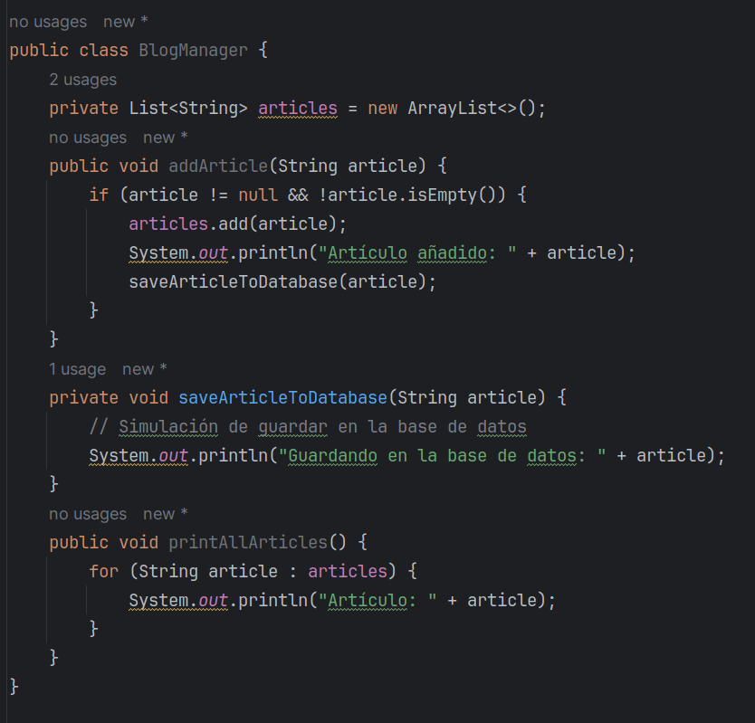

Hemos agregado los metodos añadir articulo y agregar articulo

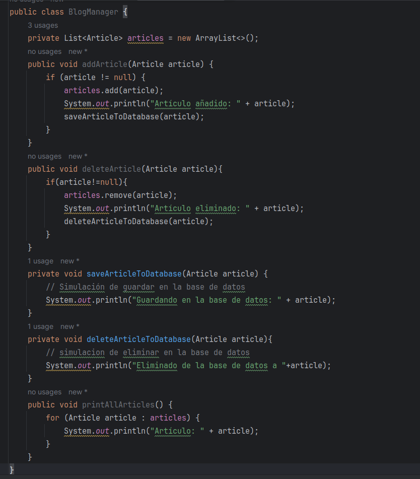

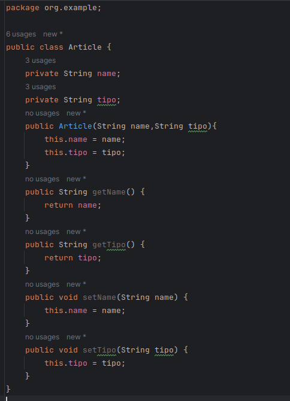

**Este codigo viola el principio de responsabilidad unica (SRP).**

La clase BlogManager tiene muchas tareas:

- **Gestion de articulos:** Añade y elimina articulos.
- **Gestion de articulos en la base de datos :** Si cambiamos de base de datos o la conexion a esta tendremos que cambiar el codigo de esta clase, o agregar nuevos metodos en los que se apoye saveArticleToDatabase, haciendo que la clase se haga mas grande.
- **Imprimir los articulos:** Si queremos cambiar el reporte que hacemos de los articulos como la cantidad de visitas, fechas, etc. entonces tambien tendremos que cambiar este metodo y posiblemente añadir nuevos metodos en la que printAllArticles se apoye.

Teniendo en cuenta estos problemas, podemos separar las clases en 3:

- La primera se encargara de gestionar los articulos : 

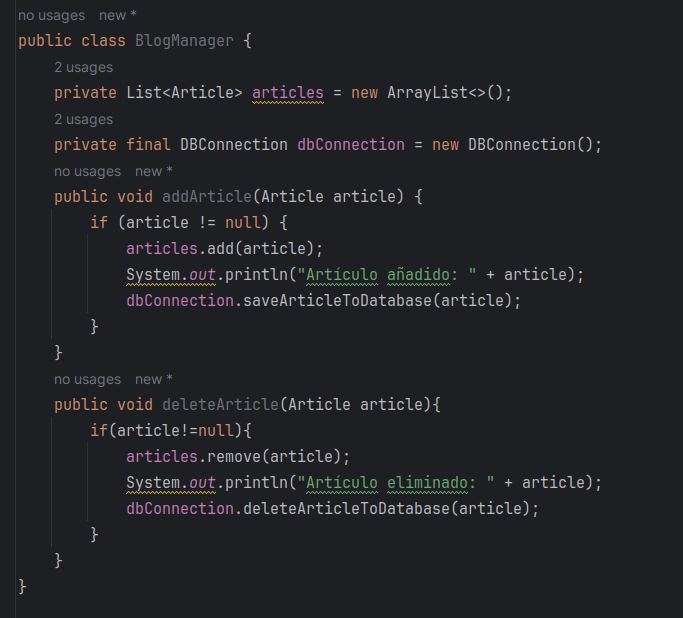

- La segunda sera nuestra conexion con la base de datos:

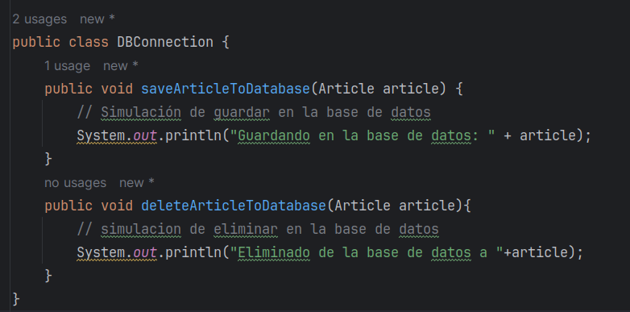

- La tercera sera el informe de los reportes:

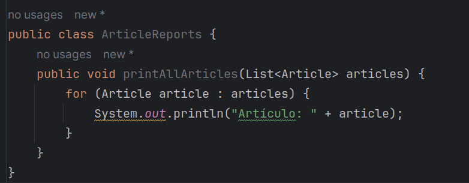

Ahora podemos ver que la clase BlogManager depende de implementaciones, en este caso de DBConnection, esto viola el principio solid de inversion de dependencias que nos dice **Las clases no deben de depender de detalles si no de abstracciones**

**Interfaz**
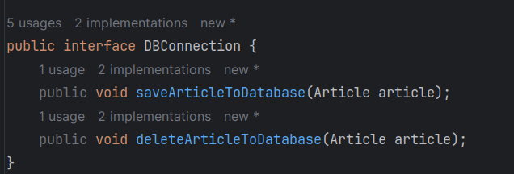

**Implementaciones**
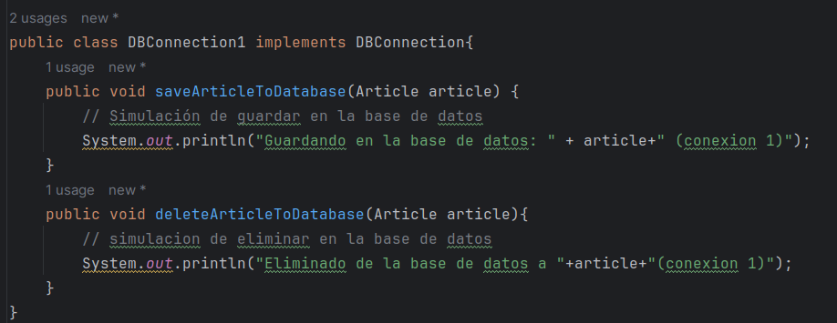

