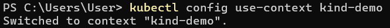

# Actividades docker

## Objetivos
- Entender las diferencias fundamentales entre la virtualización tradicional y la contenerización, y
cómo Docker revoluciona el desarrollo y la implementación de aplicaciones mediante la creación
de entornos ligeros y portátiles.
- Aprender a instalar y configurar Docker y Docker Desktop en Linux y cómo pueden facilitar el
desarrollo y la distribución de aplicaciones.
- Entender los conceptos básicos de Kubernetes como sistema de orquestación de contenedores,
y aprender a utilizar Minikube y Kind para crear y gestionar clústeres de Kubernetes en un
entorno local. Esto incluye comprender la arquitectura de Kubernetes, los objetos de
Kubernetes (pods, servicios, despliegues, etc.) y cómo se pueden manejar a través de estas
herramientas. 

Una vez descargado procedo con la instalacion de coker con las condifguraciones por defecto:

Ahora que has instalado Docker Desktop con éxito, hay que probar. Comienza ejecutando un
contenedor Docker simple directamente desde la línea de comando. Abre una ventana de
Terminal y ejecuta el siguiente comando:

                                `docker --version`

Para ver si puedes ejecutar contenedores, ingresa el siguiente comando en la ventana de
Terminal y presiona Enter:

                        `docker container run hello-world`

Visualizando en la aplicacion de Desktop:
                        
      
 Prueba con otra imagen de prueba divertida que normalmente se usa para verificar la
instalación de Docker. Ejecuta el siguiente comando:                  

## Habilitar Kubernetes en Docker Desktop

## Probando minikube y kubectl
Instalacion de minicube:

Empecemos. Sigue estos pasos cuidadosamente:
1. Intenta acceder al clúster usando kubectl. Primero, debes asegurarte de tener seleccionado el
contexto correcto para kubectl. Si anteriormente instalastes Docker Desktop y ahora minikube, puedes
usar el siguiente comando:
                    `$ kubectl config get-contexts`
                    

# Ejercicios

A veces, probar con un clúster de un solo nodo no es suficiente. minikube lo resuelve. Sigue estas
instrucciones para crear un verdadero clúster de Kubernetes de múltiples nodos en minikube:
1. Si quieres trabajar con un clúster que consta de varios nodos en minikube, podemos usar este
comando:
` minikube start --nodes 3 –p demo`
El comando anterior crea un clúster con tres nodos y lo llamas demo.

2. Utiliza kubectl para enumerar todos los nodos de tu clúster:
` kubectl get nodes ,`
Tenemos un clúster de 3 nodos donde el nodo demo es un nodo maestro y los dos nodos restantes son
nodos de trabajo.

3. No vamos a continuar con este ejemplo aquí, así que usa el siguiente comando para detener el
clúster:
` minikube stop -p demo`

4. Elimina todos los clústeres de su sistema con este comando:
` minikube delete –all`
Esto eliminará el clúster predeterminado (llamado minikube) y el clúster demo en nuestro caso.
Con esto, pasaremos a la siguiente herramienta interesante y útil a la hora de trabajar con contenedores
y Kubernetes. Deberías tenerlo instalado y disponible en la computadora de tu trabajo.

con el comando minikube status -p demo verificamos el estado del contenedor:

## Kind
Kind (https://kind.sigs.k8s.io/docs/user/quick-start) es otra herramienta popular que se puede utilizar
para ejecutar un clúster de Kubernetes de múltiples nodos localmente en tu máquina. Es muy fácil de
instalar y usar. 

2. Una vez instalado Kind, pruébalo con el siguiente comando:
 `kind version`
 

3. Ahora, intenta crear un clúster de Kubernetes simple que consta de un nodo maestro y dos nodos
trabajadores. Utiliza este comando para lograr esto:
` kind create cluster`
Después de un tiempo, deberías ver este resultado:

4. Para verificar que se ha creado un clúster, utiliza este comando:
5. Podemos crear un clúster adicional con un nombre diferente usando el parámetro --name, así:
` kind create cluster --name demo`

6. Enumera los clústeres ` kind get clusters`

Ahora podemos usar kubectl para acceder y trabajar con los clústeres que acabamos de crear. Mientras
creaba un clúster, Kind también actualizó el archivo de configuración del kubectl. Podemos verificar esto
con el siguiente comando:
$ kubectl config get-contexts
Que debería producir el siguiente resultado:
Puedes ver que los clústeres kind y de demo son parte de la lista de clústeres conocidos y que el clúster
de demo es el contexto actual para kubectl.

                        kubectl config get-contexts

Que debería producir el siguiente resultado:

Puedes ver que los clústeres kind y de demo son parte de la lista de clústeres conocidos y que el clúster
de demo es el contexto actual para kubectl.

2. Utiliza el siguiente comando para convertir el clúster de demo en tu clúster actual si el asterisco indica
que hay otro clúster actual:

                     kubectl config use-context kind-demo

3. Enumera todos los nodos del clúster de muestra:
` kubectl get nodes`
La salida debería ser así:

4. Ahora, intenta ejecutar el primer contenedor en este clúster. Usa el servidor web Nginx de confianza,
como hicistes antes. Utiliza el siguiente comando para ejecutarlo:
$ kubectl apply -f nginx.yaml
El resultado debería ser el siguiente:
pod/nginx created

5. Para acceder al servidor Nginx, necesitas realizar el reenvío de puertos usando kubectl. Utiliza este
comando para hacerlo:
` kubectl port-forward nginx 8080 80` (puedes usar otros puertos)

